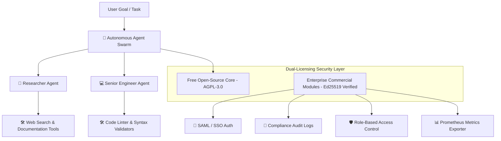

# ⚡️ Multi-Agent AI Swarm Engine (Open-Core v3.0)

> **The Enterprise-Grade Autonomous Multi-Agent AI Swarm Framework with Built-in Dual-Licensing Security.**

[](https://www.gnu.org/licenses/agpl-3.0)
[](https://github.com/saitejabandaru-in/open-core-dual-license-engine/blob/main/COMMERCIAL_LICENSE_AGREEMENT.md)
[](https://www.typescriptlang.org/)
[](https://github.com/saitejabandaru-in/open-core-dual-license-engine)

---

## ⚡️ Try It In 5 Seconds (1-Line Interactive CLI)

Run our live interactive terminal swarm playground directly on your machine:

```bash
npx tsx apps/interactive-cli/src/index.ts
```

---

## 🚀 3 Lines of Code to Spin Up an Autonomous AI Swarm

```typescript
import { BuiltInSwarms } from '@open-core/core';

// Spin up a pre-built Researcher + Senior Engineer Swarm
const swarm = BuiltInSwarms.createResearchAndCoderSwarm();

// Execute task across autonomous agents
const result = await swarm.executeSwarm('Build an enterprise API with dual-licensing');
console.log(result.swarmResults);
```

---

## 🔥 Why Developers & Enterprises Love This Framework



### 🎯 Key Capabilities Matrix

| Feature | Community Edition (AGPL-3.0) | Enterprise Commercial Edition |
| :--- | :---: | :---: |
| **Autonomous Multi-Agent Swarms** | ✅ Included | ✅ Included |
| **Tool Execution & Pipeline Processing** | ✅ Included | ✅ Included |
| **Prometheus Metrics Exporter (`/metrics`)** | ✅ Included | ✅ Included |
| **Asymmetric Ed25519 License Protection** | ❌ | ✅ Included |
| **SAML / SSO Authentication Provider** | ❌ | ✅ Included |
| **Compliance Audit Log Exporter** | ❌ | ✅ Included |
| **Role-Based Access Control (RBAC)** | ❌ | ✅ Included |
| **Smart Cloud Container & Domain Binding** | ❌ | ✅ Included |
| **Web Admin License Dashboard UI** | ❌ | ✅ Included |
| **Python & Go Verification SDKs** | ❌ | ✅ Included |

---

## 🌐 Web Admin Dashboard & REST API

Launch the live visual management portal:

```bash
npx tsx apps/dashboard/src/server.ts
```

- 🖥 **Web Portal**: `http://localhost:3000`
- 📊 **Prometheus Metrics**: `http://localhost:3000/metrics`
- 🔌 **Status REST API**: `http://localhost:3000/api/status`

---

## 💼 Open-Core & Commercial Licensing

This framework is dual-licensed:

1. **Community Edition (AGPL-3.0)**: Free for open-source developers, researchers, and non-commercial projects.
2. **Commercial License**: Required for companies using this software in proprietary closed-source applications or hosted network services without disclosing their source code.

👉 **[Read the Commercial License Agreement](./COMMERCIAL_LICENSE_AGREEMENT.md)** or contact **`licensing@yourdomain.com`** to obtain an Enterprise Commercial License Key.
